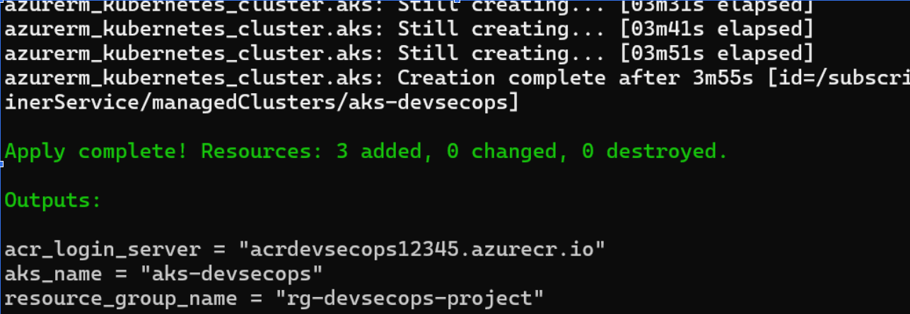
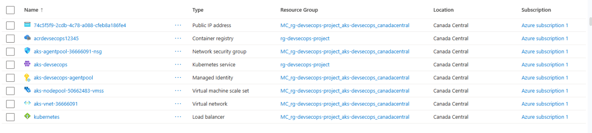
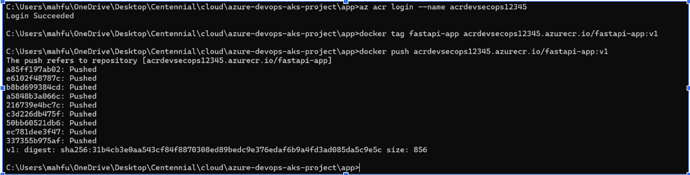
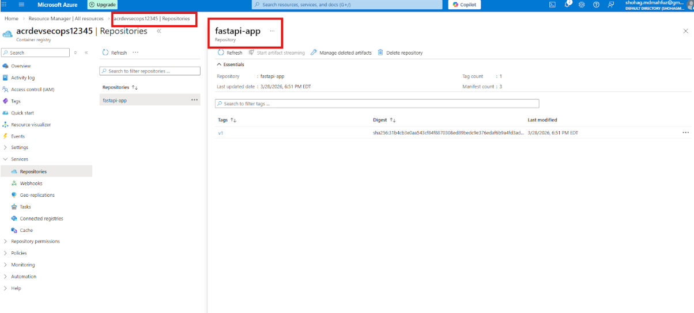
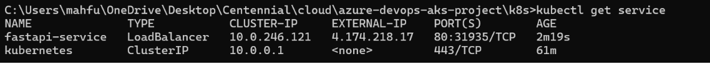
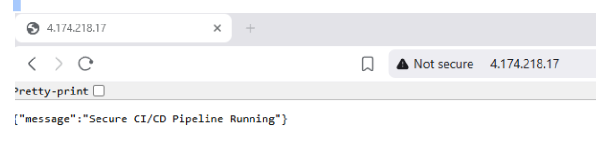
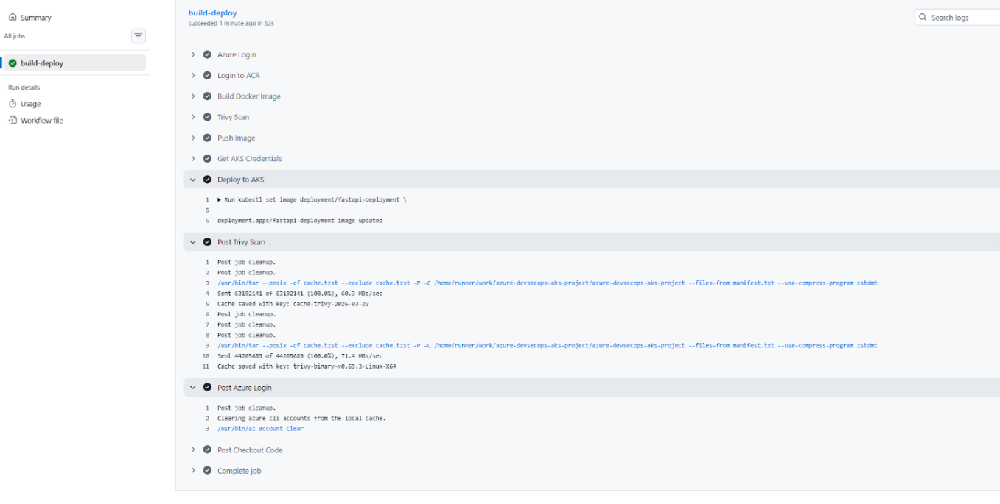

#  Secure CI/CD Pipeline for Containerized Applications on Azure (AKS)

## Project Overview
This project demonstrates a **secure, end-to-end DevSecOps pipeline** for deploying a containerized FastAPI application on Microsoft Azure.

It focuses on **real-world cloud security practices**, including identity-based authentication, secure secret management, least privilege access, and vulnerability scanning — all integrated into an automated CI/CD workflow.

---

##  Key Features
- Infrastructure provisioning using Terraform  
- Containerization with Docker  
- Secure image storage in Azure Container Registry (ACR)  
- Deployment to Azure Kubernetes Service (AKS)  
- CI/CD automation with GitHub Actions  
- Managed Identity for credential-free authentication  
- Azure Key Vault for secure secrets management  
- Trivy integration for vulnerability scanning  

---

##  Tech Stack
- Python (FastAPI)  
- Docker  
- Kubernetes (AKS)  
- Terraform  
- GitHub Actions  
- Microsoft Azure  
- Trivy  

---

##  Architecture Flow
Developer → GitHub → GitHub Actions Pipeline  
→ Build Docker Image  
→ Scan Image (Trivy)  
→ Push Image to ACR  
→ Terraform provisions infrastructure (AKS, ACR)  
→ AKS pulls image using Managed Identity  
→ Deploy to Kubernetes (Deployment + Service)  
→ Application exposed via LoadBalancer  
→ Secrets securely accessed from Azure Key Vault  

---

##  Security Implementation (DevSecOps Focus)

- **No Hardcoded Secrets / No .env Files**  
  The project strictly avoids storing any credentials, API keys, or secrets in code, configuration files, or `.env` files.

- **Managed Identity (Credential-Free Authentication)**  
  AKS uses a system-assigned Managed Identity to securely access Azure services without storing credentials.

- **Azure Key Vault (Secure Secret Management)**  
  All sensitive data is stored in Key Vault and accessed securely at runtime.

- **RBAC (Least Privilege Access)**  
  AKS is granted only the `AcrPull` role to pull images from ACR, preventing over-permission.

- **Non-Root Deployment Practices**  
  Kubernetes resources are applied without using root privileges, following least privilege and secure operational practices.

- **Container Security (Minimal Images)**  
  Lightweight base images are used to reduce the attack surface.

- **Trivy Vulnerability Scanning (Shift Left Security)**  
  Container images are scanned during CI/CD for HIGH and CRITICAL vulnerabilities before deployment.

- **Secure CI/CD Pipeline**  
  Authentication is handled using Azure Service Principal stored securely in GitHub Secrets.

- **Infrastructure as Code Security (Terraform)**  
  Terraform ensures consistent infrastructure deployment and reduces misconfiguration risks.

- **Kubernetes Workload Isolation**  
  Applications run in isolated pods and are exposed through a controlled LoadBalancer service.

---

## Security Risks Addressed

- **Vulnerable Container Images (Supply Chain Risk)**  
  Mitigated using minimal images + Trivy scanning  

- **Secret Exposure**  
  Eliminated using Managed Identity and Azure Key Vault (no `.env`, no hardcoded secrets)  

- **Over-Permission & Misconfiguration**  
  Controlled using RBAC and least privilege principles  

---

##  Repository Structure
azure-devops-aks-project/  
├── app/  
├── terraform/  
├── k8s/  
├── .github/workflows/  
├── docs/  
├── README.md  
└── .gitignore  

---
##  What I Implemented (Step-by-Step)

1. Built a FastAPI application and containerized it using Docker  
2. Created Azure infrastructure (Resource Group, ACR, AKS) using Terraform  
3. Built and tagged Docker image for Azure Container Registry  
4. Pushed Docker image to ACR  
5. Configured AKS to securely pull images using Managed Identity (AcrPull role)  
6. Deployed the application using Kubernetes Deployment and Service  
7. Exposed the application via LoadBalancer with a public IP  
8. Implemented CI/CD pipeline using GitHub Actions  
9. Integrated Trivy to scan container images before deployment  
10. Secured pipeline authentication using Azure Service Principal  

---

## Screenshots

### 🔹 Terraform Resources Created

### 🔹 Azure Resources Overview

### 🔹 Docker Image Pushed to ACR

### 🔹 ACR Repository Image

### 🔹 Kubernetes Service Public IP

### 🔹 Application Running

### 🔹 CI/CD Pipeline with Trivy Scan

---

##  Final Outcome
- Fully automated DevSecOps pipeline  
- Secure cloud-native deployment on Azure  
- Kubernetes-based orchestration  
- Integrated real-world security practices  

---

